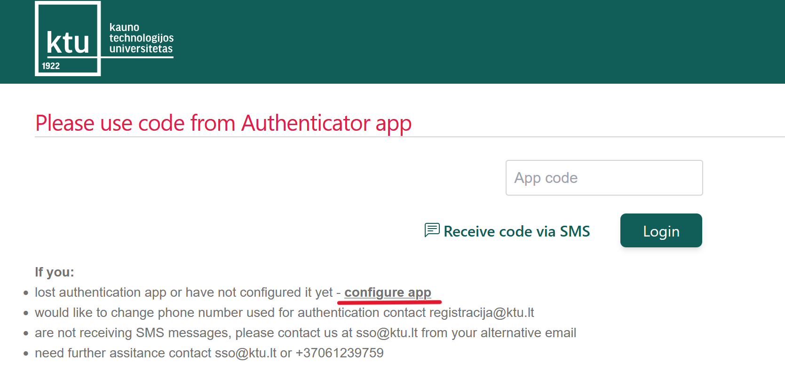
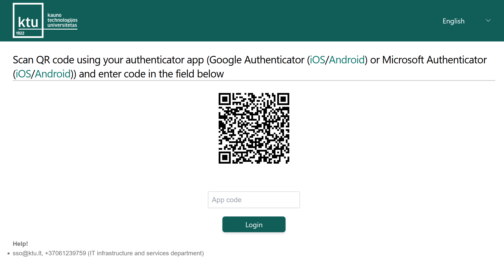
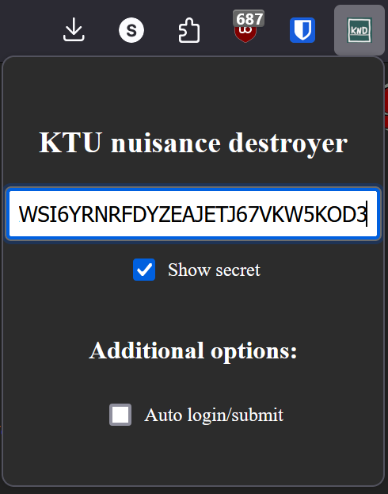

# KTU Nuisance Destroyer (KND)

KTU Nuisance Destroyer (KND) is a Firefox extension designed to streamline the login process for Kauno technologijos universitetas (KTU) by automatically generating and filling in the TOTP (Time-based One-Time Password) code on the SSO page.

## How to install
To install the addon for Firefox, you may visit [this link](https://addons.mozilla.org/firefox/downloads/file/4382939/db7b8a60751645de9c88-1.1.xpi).

## How to Use

### Step 1: Reconfigure Your Authenticator
1. **Go to the KTU SSO page** where you normally enter the authenticator code.
2. Click on **"configure app"** as shown in the image below:
   
   

3. You will be prompted to **enter a code via SMS**. Follow the instructions to receive and enter this code.
4. Once the SMS code is verified, a **QR code** will be displayed:
   
   

5. **Do not scan this QR code directly with Google Authenticator yet!** Instead:
   - Use a standard QR code scanner (e.g., your phone's camera app) to scan the QR code.
   - The scanned QR code will show text that looks like this: `otpauth://totp/TOTP68744225?secret=YOUR_SECRET_KEY&period=30&digits=6&issuer=KTU`.
   - **Extract the `secret` parameter** from this text (e.g., `YOUR_SECRET_KEY`) and save it somewhere safe.

### Step 2: Set Up KND Extension
1. **Open the KND popup**:
   - Click on the KND extension icon in your browser’s toolbar.
   
   

2. **Enter the secret**:
   - Paste the secret key (from the previous step) into the input field.
   - Optionally, you can check the **"Show secret"** box to make the key visible.

3. **Configure additional options**:
   - You can enable **"Auto login/submit"** to have the extension automatically press the "Login" button after filling in the TOTP code.

4. **Save the Secret**:
   - After entering the secret, KND will automatically save the secret and any other settings you've configured.

5. **Set Up Google Authenticator**:
   - Now, scan the QR code with your Google Authenticator app as you would normally to set up a new account.
   - **Important**: From now on, you will need to use the newly configured code generated by the extension and Google Authenticator instead of any previous codes you had.

### Step 3: Testing the Extension
1. Once the secret is entered, the KND extension is now configured.
2. When you navigate to the KTU SSO page, the extension will automatically generate and fill in the TOTP code into the **App code** field.
3. If **auto-login** is enabled, the extension will also attempt to press the "Login" button.

### Important Notes
- The TOTP code is **time-based** and expires every 30 seconds. If you wait too long to submit the code, it might become invalid. If this happens, simply refresh the page, and the extension will generate a new code.
- If you encounter any issues, open the **Developer Tools** (press `F12` or right-click the page and select "Inspect") and check the **Console** for error messages. This can help in troubleshooting.

### Troubleshooting
- Ensure that the **"Auto login/submit"** option is checked if you want the extension to automatically press the "Login" button.
- Make sure the secret is entered correctly. You can use the "Show secret" checkbox to verify the input.
- If the code is not being filled in, or auto-login is not working, check the **Console** in Developer Tools for any error messages.

### Reporting Issues
If you continue to experience issues, please submit an issue on [GitHub](https://github.com/mostghoste/KTUnuisancedestroyer). Include any relevant details and screenshots to help with troubleshooting.
